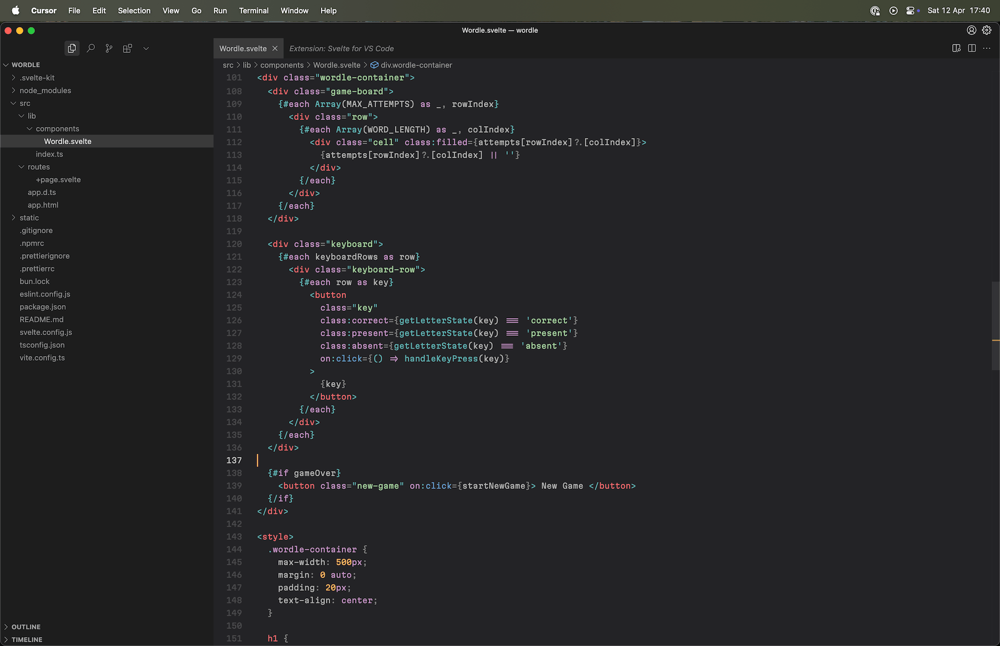
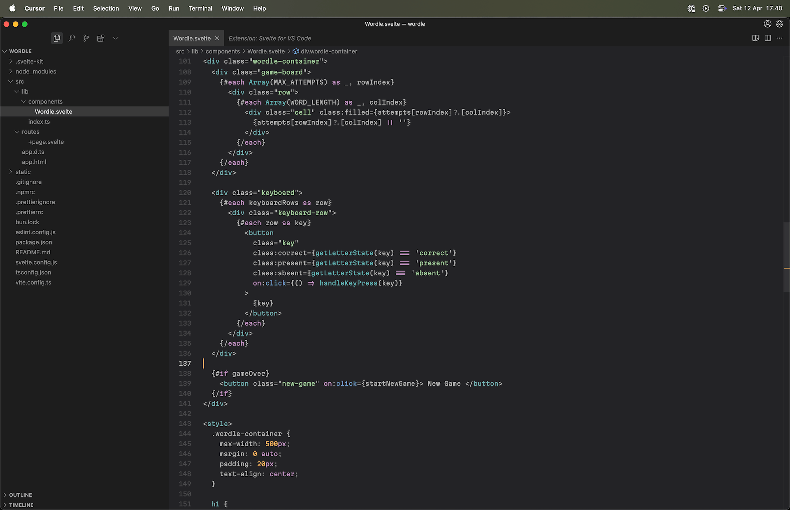
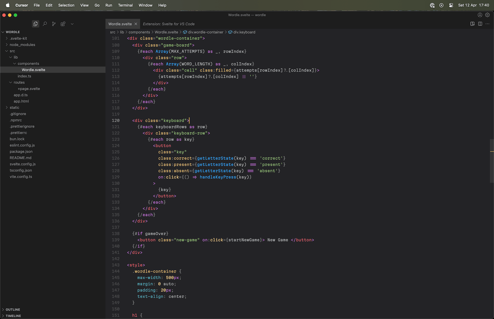
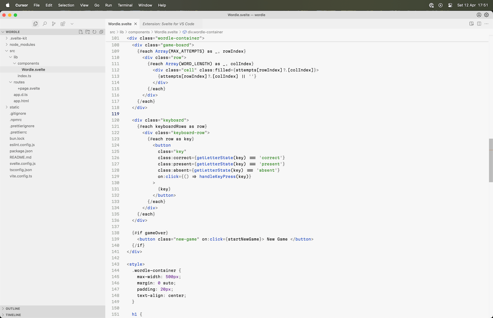
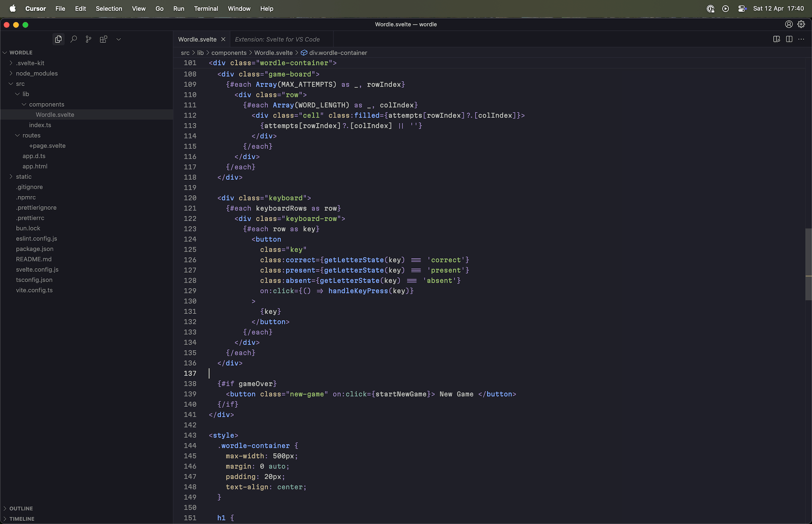
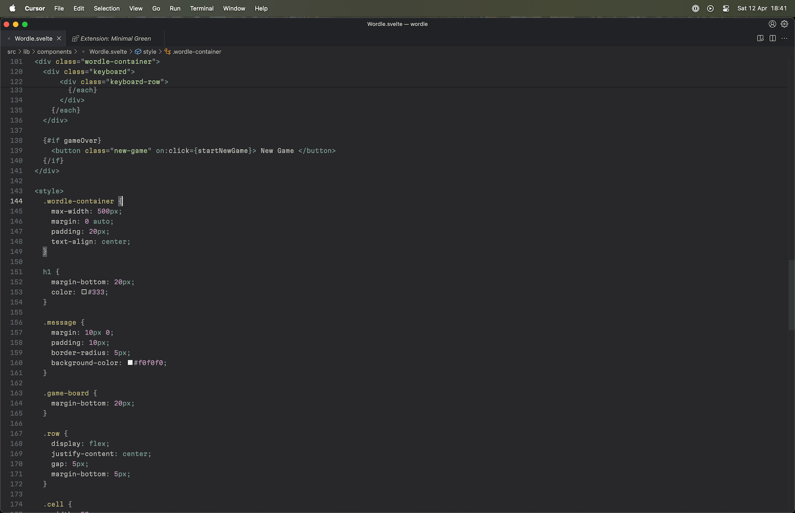

# Gossamer Theme Collection

> A gossamer is a very light, sheer, gauze-like fabric, popular for white wedding dresses and decorations.

This theme collection includes five themes: one light and four dark.

## Gossamer Dark

Gossamer Dark is loosely based on Mariana theme for Sublime Text. It features calm, unobtrusive UI colors, and muted colors for tokens.

## Gossamer Minimal

Gossamer Minimal is a modification of Gossamer Dark, but with alsmost token colors removed to create a more focused environment. The philosophy of this theme is strongly influenced by Niki Tonsky's [Alabaster theme](https://github.com/tonsky/vscode-theme-alabaster).

## Gossamer Caramel

Gossamer Caramel features lush, rich colors for tokens while keeping the UI colors calm. Great pick for an opulent mood.

## Gossamer Alabaster

Gossamer Alabaster is based on Niki Tonsky's Alabaster theme, but features slightly updated UI colors.

## Gossamer Kanagawa

Gossamer Kanagawa theme features token colors from Kanagawa theme with a few tweaks, but with softer and less vibrant UI colors.

## Gossamer Forest theme

Gossamer Forest theme features token and UI colors from [minimalGreen](https://github.com/mdoyleaz/vs-code-theme-minimal_green) theme with a few tweaks to diff editor, line selection highlight, and title bar / activity bar background colors.

## Icons

Now this theme collection also includes a set of icons forked from Moxer Icons which were removed from the VS Marketplace due to suspicion of malicious code. This is an older fork, from before the suspusion code was inserted. There is nothing but pure SVG, and certainly no JS. You can check it in `themes/icons/icons.json` and `assets` folder.
